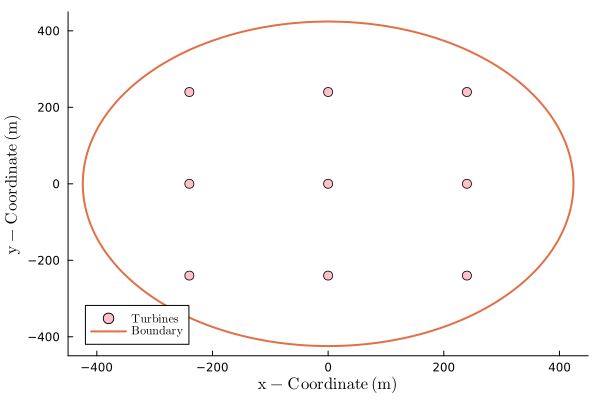
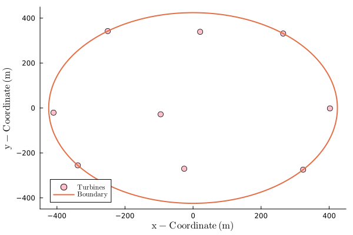

# Setting up and running an optimization

```@setup 1
include("farm_setup.jl")
```

**Note: First Complete the Quick Start**

`FLOWFarm` is specifically designed for efficient optimization using gradient-based optimization
methods. Besides the steps outlined in the [Quick Start](Tutorial.md), we need to define the following before we can run 
an optimization:

- (1) Optimization related variables
- (2) A container for non-differentiated parameters
- (3) Objective and constraint function(s) 
- (4) Optimization tool specific items

In this tutorial we demonstrate optimizing using the IPOPT algorithms via SNOW.jl for simplicity.

```@example 1
using SNOW
```

First, set up optimization related variables. We will have two constraints, one to keep 
turbines from getting too close to each other (spacing), and the other to keep turbines 
inside the desired area (boundary). `FLOWFarm` provides several different ways of handling 
boundary constraints, including concave boundaries. However, for this tutorial we will use 
a simple circular boundary.

### (1) Optimization related variables

```@example 1
# scale objective derivatives to be between 0 and 1
objectivescale = 1E-6

# scale boundary constraint derivatives to be between 0 and 1
constraintscaleboundary = 1.0E-3

# scale spacing constraint derivatives to be between 0 and 1
constraintscalespacing = 1.0

# set the minimum spacing between turbines 
minimumspacing = 160.0
nothing
```

### (2) A container for non-differentiated parameters

```@example 1
# set up a struct for use in optimization functions
mutable struct params_struct{}
    modelset
    rotorsamplepointsy
    rotorsamplepointsz
    turbinez
    ambientti
    rotordiameter
    boundarycenter
    boundaryradius
    objectivescale
    constraintscaleboundary
    constraintscalespacing
    minimumspacing
    hubheight
    turbineyaw
    ctmodels
    generatorefficiency
    cutinspeed
    cutoutspeed
    ratedspeed
    ratedpower
    windresource
    powermodels
end

params = params_struct(modelset, rotorsamplepointsy, rotorsamplepointsz, turbinez, ambientti, 
    rotordiameter, boundarycenter, boundaryradius, objectivescale, constraintscaleboundary,
    constraintscalespacing, minimumspacing, hubheight, turbineyaw, 
    ctmodels, generatorefficiency, cutinspeed, cutoutspeed, ratedspeed, ratedpower, 
    windresource, powermodels)
nothing
```

### (3) Objective and constraint function(s) 

Now we are ready to set up wrapper functions for the objective and constraints.

```@example 1
# set up boundary constraint wrapper function
function boundary_wrapper(x, params)
    # include relevant params
    boundarycenter = params.boundarycenter
    boundaryradius = params.boundaryradius
    constraintscaleboundary = params.constraintscaleboundary

    # find the number of turbines
    nturbines = Int(length(x)/2)
    
    # extract x and y locations of turbines from design variables vector
    turbinex = x[1:nturbines]
    turbiney = x[nturbines+1:end]

    # get and return boundary distances
    return FLOWFarm.circle_boundary(boundarycenter, boundaryradius, turbinex, turbiney).*constraintscaleboundary
end

# set up spacing constraint wrapper function
function spacing_wrapper(x, params)
    # include relevant params
    rotordiameter = params.rotordiameter
    constraintscalespacing = params.constraintscalespacing
    minimumspacing = params.minimumspacing

    # get number of turbines
    nturbines = Int(length(x)/2)

    # extract x and y locations of turbines from design variables vector
    turbinex = x[1:nturbines]
    turbiney = x[nturbines+1:end]

    # get and return spacing distances
    return constraintscalespacing.*(minimumspacing .- FLOWFarm.turbine_spacing(turbinex,turbiney))
end

# set up aep wrapper function
function aep_wrapper(x, params)

    # include relevant params
    turbinez = params.turbinez
    rotordiameter = params.rotordiameter
    hubheight = params.hubheight
    turbineyaw =params.turbineyaw
    ctmodels = params.ctmodels
    generatorefficiency = params.generatorefficiency
    cutinspeed = params.cutinspeed
    cutoutspeed = params.cutoutspeed
    ratedspeed = params.ratedspeed
    ratedpower = params.ratedpower
    windresource = params.windresource
    powermodels = params.powermodels
    modelset = params.modelset
    rotorsamplepointsy = params.rotorsamplepointsy
    rotorsamplepointsz = params.rotorsamplepointsy
    objectivescale = params.objectivescale

    # get number of turbines
    nturbines = Int(length(x)/2)

    # extract x and y locations of turbines from design variables vector
    turbinex = x[1:nturbines] 
    turbiney = x[nturbines+1:end]

    # calculate AEP
    aep = objectivescale*FLOWFarm.calculate_aep(turbinex, turbiney, turbinez, rotordiameter,
                hubheight, turbineyaw, ctmodels, generatorefficiency, cutinspeed,
                cutoutspeed, ratedspeed, ratedpower, windresource, powermodels, modelset,
                rotor_sample_points_y=rotorsamplepointsy,rotor_sample_points_z=rotorsamplepointsz)
    
    # return the AEP
    return aep
end

# set up optimization problem wrapper function
function wind_farm_opt!(g, x, params)

    nturbines = Int(length(x)/2)

    # calculate spacing constraint value and jacobian
    spacing_con = spacing_wrapper(x, params)

    # calculate boundary constraint and jacobian
    boundary_con = boundary_wrapper(x, params)

    # combine constaint values and jacobians into overall constaint value and jacobian arrays
    g[1:(end-nturbines)] = spacing_con[:]
    g[end-nturbines+1:end] = boundary_con[:]
    
    # calculate the objective function and jacobian (negative sign in order to maximize AEP)
    obj = -aep_wrapper(x, params)[1]
    
    return obj
end
nothing
```

The `minimize` function expects an objective function that only takes two parameters (`g` and `x`). By creating a forced signature, we are able to pass in `params` directly into the optimization.

```@example 1
# generate objective function wrapper
obj_func!(g, x) = wind_farm_opt!(g, x, params)
```

### (4) Optimization tool specific items

```@example 1
# initialize design variable vector
x0 = [copy(turbinex);copy(turbiney)]

# set general lower and upper bounds for design variables
lx = zeros(length(x0)) .- boundaryradius
ux = zeros(length(x0)) .+ boundaryradius

# set general lower and upper bounds for constraints
ng = Int(nturbines + (nturbines)*(nturbines - 1)/2)
lg = [-Inf*ones(Int((nturbines)*(nturbines - 1)/2)); -Inf*ones(nturbines)]
ug = [zeros(Int((nturbines)*(nturbines - 1)/2)); zeros(nturbines)]

# IPOPT options
ip_options = Dict(
    "max_iter" => 100,
    "tol" => 1e-6
)
solver = IPOPT(ip_options)

# initialize SNOW options
options = Options(solver=solver, derivatives=ForwardAD())  # choose AD derivatives
nothing
```

## Run the optimization

Now that the optimizer is set up, we are ready to optimize and check the results:

* Run time (`clk`)
* Optimization information (`info`)
* AEP Improvement (`100*(aepfinal - aep)/aep`)
* Optimized Turbine Positions (`turbinexopt` and `turbineyopt`)

```@example 1
# optimize
t1 = time() # start time
xopt, fopt, info, out = minimize(obj_func!, x0, ng, lx, ux, lg, ug, options)
t2 = time() # end time
clk = t2-t1 # approximate run time

# get final aep
aepfinal = -fopt/objectivescale

# print optimization results 
println("Finished in : ", clk, " (s)")
println("info: ", info)
println("Initial AEP: ", aep)
println("Final AEP: ", aepfinal)
println("AEP improvement (%) = ", 100*(aepfinal - aep)/aep) 

# extract final turbine locations
turbinexopt = copy(xopt[1:nturbines])
turbineyopt = copy(xopt[nturbines+1:end])
```

Initial turbine layout:



Final turbine layout:

