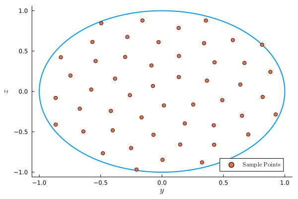
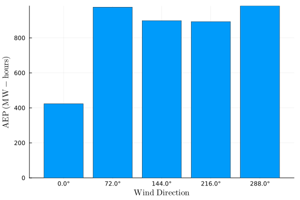
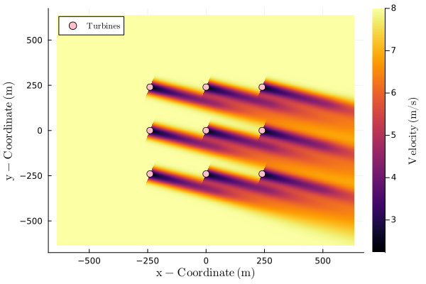

# Tutorial

This tutorial covers the basics of `FLOWFarm`. For more specifics refer to the [How-to guide](How_to.md).

This tutorial discusses how to do the following with `FLOWFarm`:
- (1) setting up a problem description
- (2) setting up an analysis model set
- (3) running analyses
- (4) calculating and visualizing a flow field

Details for setting up an optimization will depend heavily on the
optimization package you are using, your objective, and your design variables. Optimization
examples using various packages are provided in the example scripts located in the test 
directory.

## (1) Problem description

The problem description involves a definition of the wind farm, the turbines, 
and the wind resource. While this tutorial uses the same design across all the wind turbines
and mostly equal properties across all wind flow states, all turbines and flow states can 
be unique.

For API demonstration purposes, we have directly assigned all values. However, values may 
be loaded from .csv and/or .yaml files.

### Set up the running environment
```@example 1
using FLOWFarm
```

### Initialize the wind farm design
```@example 1
# set initial turbine x and y locations
turbinex = [-240.0, -240.0, -240.0, 0.0, 0.0, 0.0, 240.0, 240.0, 240.0]
turbiney = [-240.0, 0.0, 240.0, -240.0, 0.0, 240.0, -240.0, 0.0, 240.0]

# get the number of turbines
nturbines = length(turbinex)

# set turbine base heights
turbinez = zeros(nturbines)

# set turbine yaw values
turbineyaw = zeros(nturbines)

# set wind farm boundary parameters in meters (we won't really need this until we optimize)
boundarycenter = [0.0,0.0]
boundaryradius = hypot(300, 300) 
nothing
```

### Initialize wind turbine design
```@example 1
# set turbine design parameters (these values correspond to the Vestas V80 turbine)
rotordiameter = zeros(nturbines) .+ 80.0   # m
hubheight = zeros(nturbines) .+ 70.0           # m
cutinspeed = zeros(nturbines) .+ 4.0           # m/s
cutoutspeed = zeros(nturbines) .+ 25.0         # m/s
ratedspeed = zeros(nturbines) .+ 16.0          # m/s
ratedpower = zeros(nturbines) .+ 2.0E6         # W
generatorefficiency = ones(nturbines)
nothing
```

### Determine effective inflow speeds sampling method
Rotor swept area sample points are normalized by the rotor radius. These arrays define which points on the rotor swept area should be used to estimate the effective inflow
wind speed for each wind turbine. Values of 0.0 are at the rotor hub, 1.0 is at the blade
tip, `z` is vertical, and `y` is horizontal. These points track the rotor when yawed. 
A single sample point will always be placed at the hub. More points can be arranged in 
either a grid pattern or a sunflower packing pattern with various options. 
See [doc strings](Reference.md) for more information.

```@example 1
# get the sample points
nsamplepoints = 50
rotorsamplepointsy, rotorsamplepointsz = FLOWFarm.rotor_sample_points(nsamplepoints, method="sunflower")
```

The sunflower sampling method:



### Setting up the wind resource
The wind resource determines the properties of the flowfield at all wind states. A wind 
state is any combination of wind speed, wind direction, turbulence intensity, etc...

```@example 1
# set flow parameters
windspeed = 8.0        # m/2
airdensity = 1.1716    # kg/m^3
ambientti = 0.1      # %
shearexponent = 0.15
ndirections = 5
winddirections = collect(range(0, 2*pi*(1-1/ndirections), length=ndirections))   # radians
windspeeds = ones(ndirections).*windspeed   # m/s
windprobabilities = ones(ndirections).*(1.0/ndirections)       # %
ambienttis = ones(ndirections).*ambientti  # %
measurementheight = ones(ndirections).*hubheight[1] # m

# initialize the wind shear model
windshearmodel = FLOWFarm.PowerLawWindShear(shearexponent)

# initialize the wind resource definition
windresource = FLOWFarm.DiscretizedWindResource(winddirections, windspeeds, windprobabilities, 
measurementheight, airdensity, ambienttis, windshearmodel)
```

## (2) Analysis models

A model set requires a Wake Deficit Model, Wake Deflection Model, Wake Combination Model, and a Local Turbulence Intensity Model. There are several options for each model type. To facilitate research studies, any of the models in each type can be used with any of the models in any other type. However, behavior is not guaranteed. It is recommended that common, validated, model combinations be used in most cases.

Model types and options are:
* Deficit Models: JensenTopHat, JensenCosine, MultiZone, GaussOriginal, GaussYaw, GaussYawVariableSpread, GaussSimple.
* Deflection Models: GaussYawDeflection, GaussYawVariableSpreadDeflection, JiminezYawDeflection, MultizoneDeflection.
* Combination Models: LinearFreestreamSuperposition, SumOfSquaresFreestreamSuperposition SumOfSquaresLocalVelocitySuperposition, LinearLocalVelocitySuperposition.
* Turbulence Models: LocalTIModelNoLocalTI, LocalTIModelMaxTI.

The model set can be set up as follows:

Initialize the power model (other options can be found in the [Reference](Reference.md) section).
```@example 1
powermodel = FLOWFarm.PowerModelPowerCurveCubic()
```

The user can define different power models for different wind turbines, but here we use the same power model for every turbine. 
```@example 1
powermodels = Vector{typeof(powermodel)}(undef, nturbines)
for i = 1:nturbines
    powermodels[i] = powermodel
end
```

Initialize thrust model(s) (other options can be found in the [Reference](Reference.md) section). 
```@example 1
ctmodel = FLOWFarm.ThrustModelConstantCt(0.65)
ctmodels = Vector{typeof(ctmodel)}(undef, nturbines)
for i = 1:nturbines
    ctmodels[i] = ctmodel
end
```

Next, we can set up wake and related models. Here we will use the default values provided in `FLOWFarm`.
However, it is important to use the correct model parameters. More information and references
are provided in the [doc strings](Reference.md) attached to each model.

* The wake deficit model estimates the reduction in wind speed caused by the wake of a wind turbine.
* The wake deflection model predicts the lateral displacement of the wake center due to yaw misalignment or ambient wind shear.
* The wake combination model defines how the deficits from multiple wakes are aggregated to compute the total velocity deficit at a given point.
* Local turbulence intensity models estimate the turbulence intensity at each turbine or evaluation point, providing improved inputs to the wake deficit and deflection models when applicable.
```@example 1
wakedeficitmodel = FLOWFarm.GaussYawVariableSpread()
wakedeflectionmodel = FLOWFarm.GaussYawDeflection()
wakecombinationmodel = FLOWFarm.LinearLocalVelocitySuperposition()
localtimodel = FLOWFarm.LocalTIModelMaxTI()
```

Initialize the model set. 
```@example 1
modelset = FLOWFarm.WindFarmModelSet(wakedeficitmodel, wakedeflectionmodel, wakecombinationmodel, localtimodel)
nothing
```

## (3) Running the analysis

Now that the wind farm and analysis models have been defined, we can calculate AEP. The output is in Watt-hours.

```@example 1
aep = FLOWFarm.calculate_aep(turbinex, turbiney, turbinez, rotordiameter,
    hubheight, turbineyaw, ctmodels, generatorefficiency, cutinspeed,
    cutoutspeed, ratedspeed, ratedpower, windresource, powermodels, modelset,
    rotor_sample_points_y=rotorsamplepointsy, rotor_sample_points_z=rotorsamplepointsz)
```

We can also get the AEP in each wind-direction using the following.

```@example 1
state_aeps = FLOWFarm.calculate_state_aeps(turbinex, turbiney, turbinez, rotordiameter,
        hubheight, turbineyaw, ctmodels, generatorefficiency, cutinspeed,
        cutoutspeed, ratedspeed, ratedpower, windresource, powermodels, modelset,
        rotor_sample_points_y=rotorsamplepointsy, rotor_sample_points_z=rotorsamplepointsz, 
        hours_per_year=365.25*24.0, weighted=true)
```



If we instead set `weighted=false` then we would get the power in each direction in Watts.

If we want to get the individual turbine powers in each directions, we use the following.

```@example 1
turbine_powers_by_direction = FLOWFarm.calculate_state_turbine_powers(turbinex, turbiney, turbinez, rotordiameter,
    hubheight, turbineyaw, ctmodels, generatorefficiency, cutinspeed,
    cutoutspeed, ratedspeed, ratedpower, windresource, powermodels, modelset,
    rotor_sample_points_y=rotorsamplepointsy, rotor_sample_points_z=rotorsamplepointsz)
```
The output is a 2D array where each entry represents the power of a turbine, with dimensions corresponding to the number of wind directions and turbines (`ndirections` x `nturbines`).

## (4) Calculating a flow field

It is helpful to visualize the whole flow-field, not just the turbine powers. The input `wind_farm_state_id` determines which state from the wind resource is being used to calculate the flow-field. 

```@example 1
# define how many points should be in the flow field
xres = 1000
yres = 1000
zres = 1

# define flow field domain
maxy = boundaryradius*1.5
miny = -boundaryradius*1.5
maxx = boundaryradius*1.5
minx = -boundaryradius*1.5

# set up point grid for flow field
xrange = minx:(maxx-minx)/xres:maxx
yrange = miny:(maxy-miny)/yres:maxy
zrange = hubheight[1]

# run flowfarm 
ffvelocities = ff.calculate_flow_field(xrange, yrange, zrange,
    modelset, turbinex, turbiney, turbinez, turbineyaw,
    rotordiameter, hubheight, ctmodels, rotorsamplepointsy, rotorsamplepointsz,
    windresource, wind_farm_state_id=5)
```



`ffvelocities` is a three-dimensional array containing flow velocities over the specified domain. The dimensions correspond to the spatial ranges as follows: the first dimension maps to `zrange`, the second to `xrange`, and the third to `yrange`.